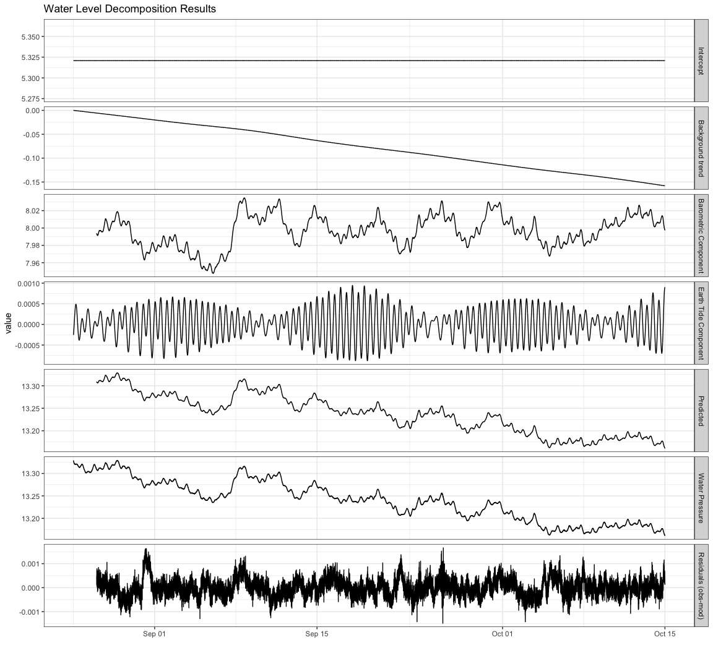
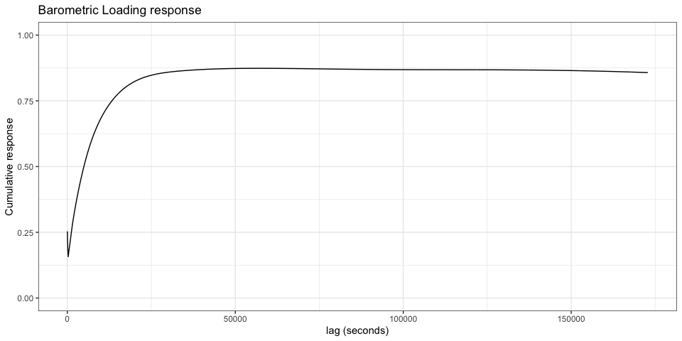
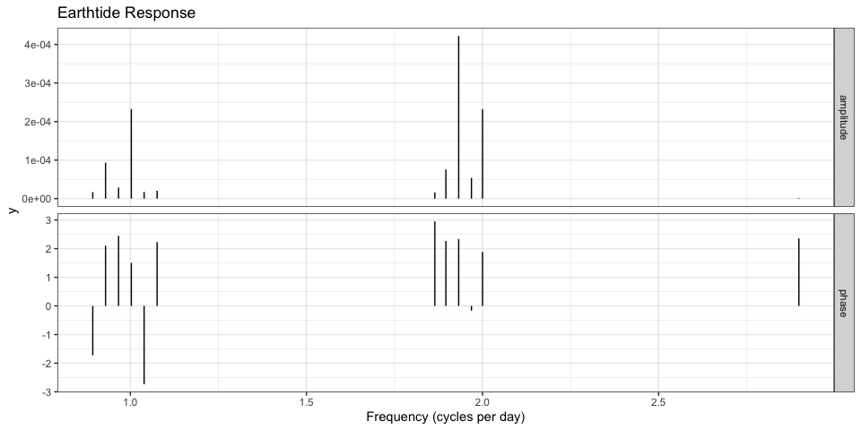

<!-- README.md is generated from README.Rmd. Please edit that file -->

# hydrorecipes

<!-- badges: start -->

[](https://CRAN.R-project.org/package=hydrorecipes)
[](https://github.com/jkennel/hydrorecipes/actions/workflows/R-CMD-check.yaml)
[](https://www.gnu.org/licenses/gpl-3.0)
[](https://app.codecov.io/gh/jkennel/hydrorecipes?branch=master)
<!-- badges: end -->

The goal of **hydrorecipes** is to supplement the [recipes
package](https://recipes.tidymodels.org) with a few steps that can help
deal with moderately sized water level datasets. These were developed
primarily with regression deconvolution in mind and used *lm* or
*glmnet*, but other model engines could also be used. The following
steps are currently available:

-   *step_lead_lag* is a more flexible version of *step_lag* from the
    [recipes package](https://recipes.tidymodels.org). Values can be
    negative which indicates the vector is lead. In addition, subsetting
    can be done on the dataset during this process when dealing with
    very large datasets leading to performance gains without sacrificing
    temporal accuracy.
-   *step_distributed_lag* is a distributed lag approach for modelling
    the response in a flexible yet concise manner. This is useful when
    you have a long maximum lag or large datasets.
-   *step_earthtide* uses the [earthtide
    package](https://CRAN.R-project.org/package=earthtide) to model the
    synthetic Earth tide given locations and times. This can provide a
    single Earth tide curve or a set of harmonics that can be used in
    regression models.

## Installation

You can install the development version of **hydrorecipes** from
[GitHub](https://github.com/) with:

``` r
# install.packages("remotes")
remotes::install_github("jkennel/hydrorecipes")
```

## Example

This is the method of [Kennel 2020](http://hdl.handle.net/10214/17890)
which uses a distributed lag model and the [earthtide
package](https://CRAN.R-project.org/package=earthtide) to generate
synthetic wave groups. A \~1.5 month dataset of water and barometric
pressure having a monitoring frequency of 2 minutes is presented below.
The barometric response is modeled over two days using a distributed lag
model with 15 regressor terms. The *knots* are logarithmically separated
over two days to accurately capture early and late time responses which
can be caused by different physical mechanisms.

``` r
library(hydrorecipes)
library(earthtide)
library(tidyr)
library(ggplot2)

data(transducer)

# convert to numeric because step_ns doesn't handle POSIXct
transducer$datetime_num <- as.numeric(transducer$datetime)

unique(diff(transducer$datetime_num)) # times are regularly spaced
#> [1] 120

# Earth tide inputs
wave_groups <- earthtide::eterna_wavegroups
wave_groups <- na.omit(wave_groups[wave_groups$time == '1 month', ])
wave_groups <- wave_groups[wave_groups$start > 0.5, ]
latitude    <- 34.0
longitude   <- -118.5

# create recipe 
rec <- recipe(wl~baro+datetime_num, transducer) |>
  step_distributed_lag(baro, knots = log_lags(15, 86400 * 2 / 120)) |>
  step_earthtide(datetime_num,
                 latitude = latitude,
                 longitude = longitude,
                 astro_update = 1,
                 wave_groups = wave_groups) |>
  step_ns(datetime_num, deg_free = 10) |>
  prep()

input <- rec |> bake(new_data = NULL)
```

``` r
summary(fit <- lm(wl~., input))
#> 
#> Call:
#> lm(formula = wl ~ ., data = input)
#> 
#> Residuals:
#>        Min         1Q     Median         3Q        Max 
#> -1.483e-03 -2.351e-04 -1.957e-05  2.122e-04  1.661e-03 
#> 
#> Coefficients:
#>                           Estimate Std. Error   t value Pr(>|t|)    
#> (Intercept)              5.321e+00  2.253e-03  2361.583  < 2e-16 ***
#> distributed_lag_baro_1  -1.940e-01  1.153e-02   -16.823  < 2e-16 ***
#> distributed_lag_baro_2   2.382e-02  8.787e-03     2.710  0.00672 ** 
#> distributed_lag_baro_3   7.708e-03  5.264e-03     1.464  0.14308    
#> distributed_lag_baro_4   1.379e-02  2.477e-03     5.566 2.63e-08 ***
#> distributed_lag_baro_5   9.756e-03  1.226e-03     7.955 1.84e-15 ***
#> distributed_lag_baro_6   7.818e-03  5.498e-04    14.218  < 2e-16 ***
#> distributed_lag_baro_7   6.230e-03  2.341e-04    26.609  < 2e-16 ***
#> distributed_lag_baro_8   3.435e-03  9.674e-05    35.510  < 2e-16 ***
#> distributed_lag_baro_9   1.633e-03  4.091e-05    39.918  < 2e-16 ***
#> distributed_lag_baro_10  1.946e-04  1.802e-05    10.800  < 2e-16 ***
#> distributed_lag_baro_11  6.958e-05  8.130e-06     8.558  < 2e-16 ***
#> distributed_lag_baro_12 -6.846e-05  4.434e-06   -15.441  < 2e-16 ***
#> distributed_lag_baro_13 -7.734e-02  1.515e-03   -51.058  < 2e-16 ***
#> distributed_lag_baro_14  2.007e-01  3.929e-03    51.080  < 2e-16 ***
#> distributed_lag_baro_15 -1.235e-01  2.415e-03   -51.131  < 2e-16 ***
#> earthtide_cos_1         -9.055e-06  3.359e-06    -2.696  0.00702 ** 
#> earthtide_sin_1          4.111e-06  3.390e-06     1.213  0.22524    
#> earthtide_cos_2          8.808e-05  3.475e-06    25.349  < 2e-16 ***
#> earthtide_sin_2         -3.562e-05  3.502e-06   -10.173  < 2e-16 ***
#> earthtide_cos_3          2.843e-05  2.970e-06     9.573  < 2e-16 ***
#> earthtide_sin_3         -3.611e-05  2.896e-06   -12.467  < 2e-16 ***
#> earthtide_cos_4          1.940e-04  7.839e-06    24.750  < 2e-16 ***
#> earthtide_sin_4          4.292e-05  6.851e-06     6.265 3.78e-10 ***
#> earthtide_cos_5         -4.412e-06  3.250e-06    -1.357  0.17464    
#> earthtide_sin_5         -1.397e-05  3.251e-06    -4.298 1.73e-05 ***
#> earthtide_cos_6          1.090e-05  3.714e-06     2.934  0.00335 ** 
#> earthtide_sin_6         -8.238e-06  3.728e-06    -2.210  0.02712 *  
#> earthtide_cos_7          4.002e-06  2.065e-06     1.938  0.05263 .  
#> earthtide_sin_7         -1.588e-05  2.067e-06    -7.684 1.59e-14 ***
#> earthtide_cos_8          5.720e-05  2.562e-06    22.331  < 2e-16 ***
#> earthtide_sin_8         -4.668e-05  2.562e-06   -18.219  < 2e-16 ***
#> earthtide_cos_9          3.009e-04  2.695e-06   111.630  < 2e-16 ***
#> earthtide_sin_9         -2.924e-04  2.683e-06  -109.003  < 2e-16 ***
#> earthtide_cos_10        -6.168e-06  3.315e-06    -1.860  0.06285 .  
#> earthtide_sin_10         5.686e-05  3.306e-06    17.198  < 2e-16 ***
#> earthtide_cos_11         2.369e-04  6.471e-06    36.605  < 2e-16 ***
#> earthtide_sin_11        -5.476e-05  5.819e-06    -9.410  < 2e-16 ***
#> earthtide_cos_12         2.122e-06  2.531e-06     0.838  0.40194    
#> earthtide_sin_12        -2.205e-06  2.536e-06    -0.870  0.38448    
#> datetime_num_ns_01      -2.965e-02  2.892e-05 -1025.095  < 2e-16 ***
#> datetime_num_ns_02      -4.064e-02  3.792e-05 -1071.627  < 2e-16 ***
#> datetime_num_ns_03      -6.178e-02  3.313e-05 -1864.753  < 2e-16 ***
#> datetime_num_ns_04      -7.808e-02  3.445e-05 -2266.602  < 2e-16 ***
#> datetime_num_ns_05      -9.233e-02  3.316e-05 -2784.028  < 2e-16 ***
#> datetime_num_ns_06      -1.100e-01  3.553e-05 -3095.275  < 2e-16 ***
#> datetime_num_ns_07      -1.264e-01  3.354e-05 -3768.390  < 2e-16 ***
#> datetime_num_ns_08      -1.355e-01  2.239e-05 -6053.491  < 2e-16 ***
#> datetime_num_ns_09      -1.639e-01  7.195e-05 -2278.361  < 2e-16 ***
#> datetime_num_ns_10      -1.499e-01  1.563e-05 -9587.262  < 2e-16 ***
#> ---
#> Signif. codes:  0 '***' 0.001 '**' 0.01 '*' 0.05 '.' 0.1 ' ' 1
#> 
#> Residual standard error: 0.0003564 on 35231 degrees of freedom
#>   (1440 observations deleted due to missingness)
#> Multiple R-squared:  0.9999, Adjusted R-squared:  0.9999 
#> F-statistic: 1.067e+07 on 49 and 35231 DF,  p-value: < 2.2e-16
```

## Decomposition

The decomposition consists of:

-   **Intercept** A single offset value (meters_water)
-   **Background trend** The background trend determined using natural
    splines (dbar)
-   **Barometric Component** The barometric component of the water
    pressure determined using distributed lag terms (dbar)
-   **Earth tide Component** The Earth tides component determined using
    harmonic analysis (dbar)
-   **Predicted** The sum of all the components above. This is the
    predicted water pressure. (dbar)
-   **Water Pressure** The observed water pressure measured with a
    non-vented transducer (dbar)
-   **Residuals (obs-mod)** The difference between the observed water
    pressure and the modeled pressure (Predicted). (dbar)

``` r
pred <- predict_terms(fit = fit, 
                      rec = rec,
                      data = input)
pred <- bind_cols(transducer[, c('datetime', 'wl')], pred)
pred$residuals <- pred$wl - pred$predicted
pred_long <- pivot_longer(pred, cols = !datetime)
levels <-c('intercept', 'ns_datetime_num', 'distributed_lag_baro',
           'earthtide_datetime_num', 'predicted', 'wl', 'residuals')
labels <- c('Intercept', 'Background trend', 'Barometric Component',
            'Earth Tide Component', 'Predicted', 'Water Pressure', 
            'Residuals (obs-mod)')
pred_long$name <- factor(pred_long$name, 
                         levels = levels,
                         labels = labels)
ggplot(pred_long, aes(x = datetime, y = value)) +
  geom_line() + 
  scale_y_continuous(labels = scales::comma) + 
  scale_x_datetime(expand = c(0,0)) + 
  ggtitle('Water Level Decomposition Results') + 
  xlab("") + 
  facet_grid(name~., scales = 'free_y') + 
  theme_bw()
```



## Response

There are two responses for this model:

-   **distributed_lag** The barometric loading response. This is an
    impulse response function and the cumulative response is usually
    presented. This value typically ranges between 0 and 1 and
    represents the expected water pressure/level change following a 1
    unit change in barometric pressure. The same units for water
    pressure and barometric pressure should be used (Figure A).
-   **earthtide** The Earth tide response is represented by a set of
    harmonic wave groups. These results are usually presented as
    amplitude and phase as a function of frequency. Depending on the
    length of your dataset you may want to include more harmonic
    wavegroups. For locations with minimal ocean tide effects it may be
    useful to compare the relative amplitudes to theory as an assessment
    of the model quality (how well all other signals were removed). The
    phase shift for small amplitude components may not be reliable
    (Figure B).

``` r
resp    <- response(fit, rec)
resp_ba <- resp[resp$name == 'cumulative', ]
resp_ba <- resp_ba[resp_ba$term == 'baro', ]
ggplot(resp_ba, aes(x = x * 120 / 3600, y = value)) +
  ggtitle('A: Barometric Loading Response') + 
  xlab('lag (hours)') +
  ylab('Cumulative Response') +
  scale_y_continuous(limits = c(0, 1)) +
  geom_line() + 
  theme_bw()
resp_et <- resp[resp$name %in% c('amplitude', 'phase'), ]
ggplot(resp_et, aes(x = x, xend = x, y = 0, yend = value)) +
  geom_segment() + 
  ggtitle('B: Earthtide Response') +
  xlab('Frequency (cycles per day)') +
  ylab('Phase (radians)   |   Amplitude (dbar)') +
  facet_grid(name~., scales = 'free_y') + 
  theme_bw()
```


